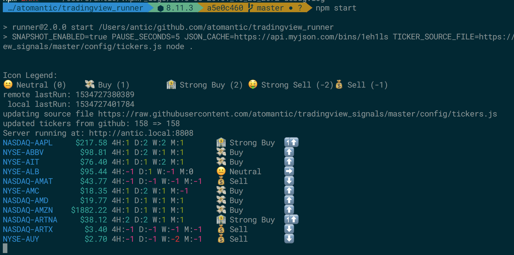

> NOTICE: I am not a financial or trading advisor. This tool comes without any warrenty or assurances. None of the stock tickers listed or the results found within this codebase indicate a recommendation to buy or sell assets. Use at your own risk.

# Technical Signal Caching Engine

I use this project to get signals from TradingView, cache them on myjson, and ingest them into a Google Sheets to alert me of whether I should buy or sell particular holdings (based on whether my current position in those assets is underwater or in profit).

My general starting strategy is something like this (but has been evolving):

- If the meta indicator (summary of summaries over time periods) says `Buy`
    - If my cost-basis is lower than current price: `buy`
    - if my cost-basis is higher than the current price, `buy` only at regular intervals (1 share per week/month/etc), else `hold` if I've already bought recently
- If the meta indicator says `Sell`
    - If my cost-basis is lower than current price: `hold`
    - if my cost-basis is higher than the current price: `sell`
- Neutral = `hold`
- `Strong Sell` and `Strong Buy` signals just increase the color coding darkness in the Google Sheet, which informs me of the quanitity I might wish to buy. I might sell half on a `Sell` and sell all on a `Strong Sell`.

Additionally, these indicators are still only prompting suggestions that require human evaluation. I consider other factors such as insider trading (e.g. insiders buying a bunch of stock in a mining company: https://www.secform4.com/insider-trading/1600470.htm) before making a decision. Sometimes, I still open TradingView to manually eyeball the RSI, Stochastic RSI, Ultimate Oscillator, Ichi Cloud, etc.

I might post the Google Sheets template logic later...

# Local Setup
```
# run setup
npm run setup
```
this will:
* ensure casper/phantom are installed globally via `npm i -g phantomjs-prebuilt casperjs`

## Local Run
```
npm start
```


## Testing
You can run a single ticker test like so:
```
TICKER=NASDAQ-AAPL SNAPSHOT_ENABLED=1 casperjs test --fail-fast --verbose --web-security=no --ignore-ssl-errors=true --load-images=false lib/technicals.js
```
This will store a screencapture in `./snaps/` and output verbose data

## Deploy
This runs on now.sh very easily, but I am in the process of moving it to either AWS or Google Cloud so I can store the data long term and run backtesting/ML on the data.

### Now.sh
```
# deploy to now.sh (as https://signals.now.sh)
./deploy
```
#### Keeping now.sh alive
now.sh will expire a container if it isn't being hit regularly
hit it by leaving a running job like this:
```
watch -n 120 curl https://signals.now.sh/
```

# Data
For all logs and db files, the following legend maps TradingView Summary Signal status to numeric values:

- `Strong Buy` = 2
- `Buy` = 1
- `Neutral` = 0
- `Sell` = -1
- `Strong Sell` = -2

## Results

`latest.json` is a snapshot of the latest runs for each ticker. It is only the most recent run without historical context. This is used by the Google Sheet to determine the current state. This set maintains the last different state each summary was in:
```javascript
{
    "tickers": {
      "NASDAQ-EKSO": {
      "ma": [
        [2.59], // 4 hour Hull MA
        [2.84], // 1 day Hull MA
        [2.71], // 1 week Hull MA
        [2.04]  // 1 month Hull MA
      ],
      "osc": [
        [ // 4 hour oscillators
          54.83, // rsi
          0.98, // stoch rsi
          32.13, // stoch
          34.48 // ultimate osc
          1, // macd numeric directional indicator
        ],
        [ // 1 day oscillators
          60.53,
          64.05,
          0.26,
          57.64,
          51.31
        ],
        [ // 1 week oscillators
          65.11,
          73.07,
          0.18,
          95.43,
          45.37
        ],
        [ // 1 month oscillators
          46.35,
          27.77,
          -1.22,
          93.2,
          41.74
        ]
      ],
        "price": 2.72,
        "time": 1534604640049, // unix timestamp
        "sum": [1,2,1,1], // summary values for periods (4 hour, 1 day, 1 week, 1 month)
        "prev": [2,1,2,1], // last different values in those windows
        "meta": 1, // current meta summary signal accross time periods
        "from": 2 // last different summary
      }
    },
    "time": 1534611504984,
    "last": "NASDAQ-CIBR"
  }
```

## Signals Files

Additionally, we save every single hit to a rolling log file, which we can use for backtesting strategies, and to see if the current signal is either moving up or down (direction is important). We use the last known state to know if the signal is either retreating or moving forward.

The rolling logs are capped at 100MB and are saved as minimal csv files using numeric indicators to create smaller files.

The column headers for the files are the following:

```
ticker  price   time    meta_signal    meta_previous
4_hour_summary  1_day_summary   1_week_summary  1_month_summary
4_hour_summary_from  1_day_summary_from   1_week_summary_from  1_month_summary_from
4h_rsi, 1d_rsi, 1w_rsi, 1m_rsi,
4h_stochrsi, 1d_stochrsi, 1w_stochrsi, 1m_stochrsi,
4h_stoch, 1d_stoch, 1w_stoch, 1m_stoch,
4h_ult, 1d_ult, 1w_ult, 1m_ult,
4h_macd, 1d_macd, 1w_macd, 1m_macd,
4h_hull, 1d_hull, 1w_hull, 1m_hull
```

The signal database creates 8KB per full run.
Any results that exactly match the previous result (nothing changed in price or signals), will not be saved to the rolling DB file. This means that generally all day Saturday and Sunday, there will be no new db activity since the markets are closed. It's probably best to not run this on the weekends or late at night when it won't add any value.
Each run takes ~1 hour.
This should create ~25MB per year worth of data


## Cleaning Errors

### Jupyter Notebook
As a quick interactive, rapid-dev-feedback practice, I usually start python data ETL tasks in Jupyter to quickly visualize it (also allows using matplotlib UI). My process for sanitizing the data currently is in a Jupyter notebook:
```
cd data;
docker run -it -v $(pwd):/home/jovyan --rm -p 8888:8888 jupyter/scipy-notebook
```
This outputs `./data/signals.csv`, which is the combined, sanitized database file of unique data on each ticker over time. This can then be thrown into BigQuery/DynamoDB or some other system to run ML, draw charts, or run other queries.

## Sync to Google Cloud Storage
```
gsutil rsync -d data gs://stock-tickers/data
```

# BigQuery ML

## Load into BigQuery
```
# from cloud storage
bq mk ticker_tracker
bq load --source_format=CSV --location=US ticker_tracker.signals gs://stock-tickers/data/signals.csv \
  ticker:string,price:float,change:float,time:integer,\
  meta_signal:integer,meta_previous:integer,\
  h:integer,d:integer,w:integer,m:integer,\
  hp:integer,dp:integer,wp:integer,mp:integer,\
  h_rsi:float, d_rsi:float, w_rsi:float, m_rsi:float,\
  h_stochrsi:float, d_stochrsi:float, w_stochrsi:float, m_stochrsi:float,\
  h_stoch:float, d_stoch:float, w_stoch:float, m_stoch:float,\
  h_ult:float, d_ult:float, w_ult:float, m_ult:float,\
  h_macd:float, d_macd:float, w_macd:float, m_macd:float,\
  h_hull:float, d_hull:float, w_hull:float, m_hull:float,\
  h_ma:float, d_ma:float, w_ma:float, m_ma:float,\
  h_ma_change:float, d_ma_change:float, w_ma_change:float, m_ma_change:float,\
  move:integer,\
  exchange:string,name:string
```

## Linear Regression Model

create model
```
CREATE MODEL
  `signals.model_aapl_price`
OPTIONS
  ( model_type='linear_reg',
    ls_init_learn_rate=.15,
    l1_reg=1,
    max_iterations=5,
    data_split_method='seq',
    data_split_eval_fraction=0.3,
    data_split_col='time' ) AS
SELECT
  meta_signal,
  meta_previous,
  h,d,w,m,
  hp,dp,wp,mp,move,
  h_stochrsi, d_stochrsi, w_stochrsi, m_stochrsi,
  h_stoch, d_stoch, w_stoch, m_stoch,
  h_ult, d_ult, w_ult, m_ult,
  h_macd, d_macd, w_macd, m_macd,
  h_hull, d_hull, w_hull, m_hull,
  h_ma, d_ma, w_ma, m_ma,
  h_ma_change, d_ma_change, w_ma_change, m_ma_change,
  time,
  price
FROM
  `ticker_tracker.signals`
WHERE
  name = "AAPL"
```

predict
```
SELECT
  *
FROM
  ML.PREDICT(MODEL `signals.model_aapl_price`,
    (
    SELECT
      price,
      time,
      meta_signal,
      meta_previous,
      h,d,w,m,
      hp,dp,wp,mp,move,
    FROM
      `ticker_tracker.signals`
    WHERE
      name = "AAPL"))
```